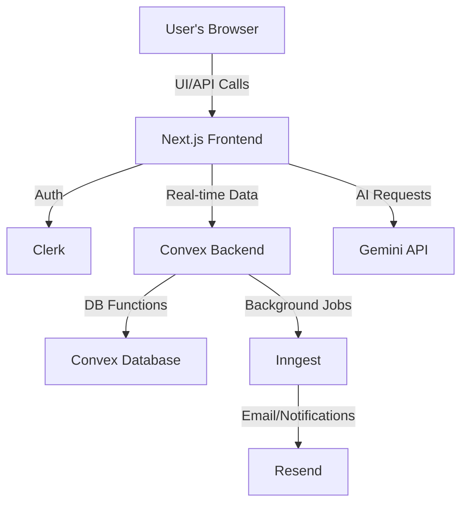

# Bill Buddy – Smart Expense Splitter

Bill Buddy is a modern, full-stack web application for tracking, splitting, and settling shared expenses with friends, roommates, or groups. Inspired by Splitwise, it leverages the latest technologies for a seamless, real-time experience.

---

## 🚀 Features

- **Effortless Expense Splitting:**  
  Add personal or group expenses, split bills, and track who owes whom.

- **Groups & Contacts:**  
  Organize expenses by groups (e.g., trips, roommates) or 1-to-1 contacts.

- **Real-Time Updates:**  
  All changes sync instantly across devices using [Convex](https://convex.dev/).

- **Authentication:**  
  Secure sign-in/sign-up with [Clerk](https://clerk.com/).

- **Modern UI:**  
  Built with [Next.js](https://nextjs.org/), [Tailwind CSS](https://tailwindcss.com/), and [shadcn/ui](https://ui.shadcn.com/).

- **Notifications & Email:**  
  Get notified of group activity and settlements (via [Resend](https://resend.com/)).

- **AI Assistance:**  
  Smart suggestions and summaries powered by Gemini AI.

---

## 🛠️ Tech Stack

- **Frontend:** Next.js 14, React, Tailwind CSS, shadcn/ui
- **Backend:** Convex (serverless database & functions)
- **Auth:** Clerk
- **Email:** Resend
- **AI:** Gemini API
- **Other:** Inngest (background jobs), Sonner (toasts)

---

## 🏗️ Architecture



- **Frontend (Next.js):** Handles UI, routing, and API calls. Communicates with Clerk for authentication and Convex for real-time data.
- **Clerk:** Manages user authentication and sessions.
- **Convex:** Serverless backend for data storage, queries, and mutations. Provides real-time sync to the frontend.
- **Inngest:** Schedules and runs background jobs (e.g., payment reminders, analytics).
- **Resend:** Sends email notifications (e.g., reminders, settlements).
- **Gemini API:** Provides AI-powered features (summaries, suggestions).

---

## 🏁 Getting Started

1. **Clone the repository:**
   ```bash
   git clone https://github.com/your-username/billbuddy.git
   cd billbuddy
   ```

2. **Install dependencies:**
   ```bash
   npm install
   # or
   yarn install
   ```

3. **Set up environment variables:**

   Create a `.env` file in the root directory with the following variables:

   ```
   # Convex
   CONVEX_DEPLOYMENT=
   NEXT_PUBLIC_CONVEX_URL=

   # Clerk (Authentication)
   NEXT_PUBLIC_CLERK_PUBLISHABLE_KEY=
   CLERK_SECRET_KEY=
   NEXT_PUBLIC_CLERK_SIGN_IN_URL=/sign-in
   NEXT_PUBLIC_CLERK_SIGN_UP_URL=/sign-up
   CLERK_JWT_ISSUER_DOMAIN=

   # Resend (Email)
   RESEND_API_KEY=

   # Gemini (AI)
   GEMINI_API_KEY=
   ```

4. **Start the development server:**
   ```bash
   npm run dev
   # or
   yarn dev
   ```

5. **Run Convex locally (in a separate terminal):**
   ```bash
   npx convex dev
   ```

---

## 📁 Project Structure

- `/app` – Next.js app routes (pages, layouts, API)
- `/components` – Reusable UI components (Header, Footer, Modals, etc.)
- `/convex` – Convex backend logic (queries, mutations, schema)
- `/hooks` – Custom React hooks (e.g., useConvexQuery)
- `/public` – Static assets (images, logo)
- `/styles` – Global styles (Tailwind config, etc.)

---

## 🌱 Future Features

- **Mobile App:** Native iOS/Android app for on-the-go expense tracking.
- **Payment Integrations:** Directly settle up via UPI, PayPal, or other payment gateways.
- **Recurring Expenses:** Automatically add repeating expenses (e.g., rent, subscriptions).
- **Multi-Currency Support:** Track expenses in different currencies with real-time conversion.
- **Advanced Analytics:** Visualize spending trends, group stats, and personal finance insights.
- **Group Chat:** Built-in chat for group discussions and expense clarifications.
- **Receipt Scanning:** Use OCR to extract expense details from photos of receipts.
- **Custom Categories:** Allow users to create and manage their own expense categories.
- **More Notification Channels:** Push notifications, SMS, or WhatsApp reminders.
- **Expense Approval Flows:** Require group approval for large or unusual expenses.

---

## 🤝 Contributing

Contributions are welcome! To get started:

1. Fork the repository
2. Create a new branch (`git checkout -b feature/your-feature`)
3. Make your changes and commit them
4. Push to your fork and open a Pull Request

Please follow the existing code style and add tests where appropriate.

---


